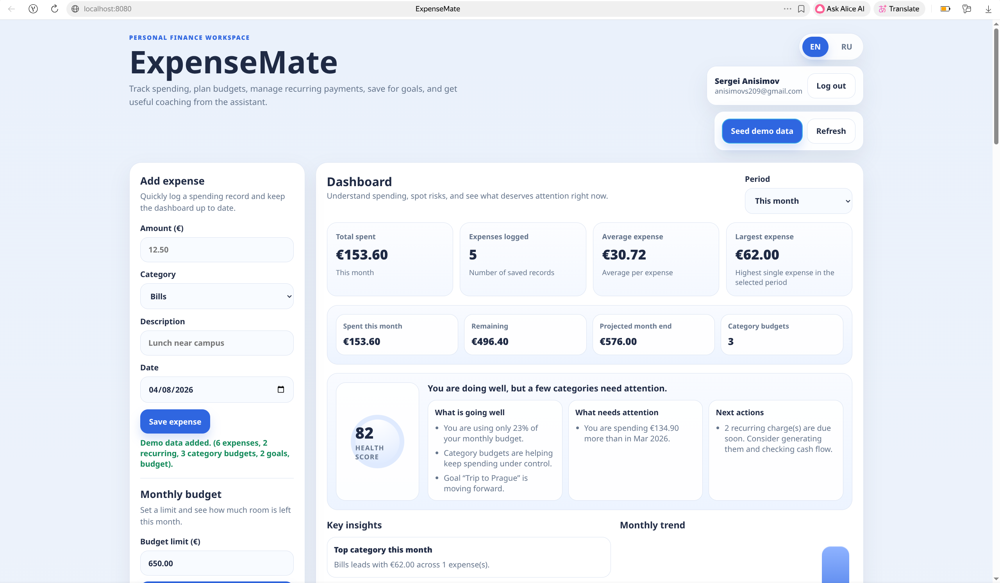
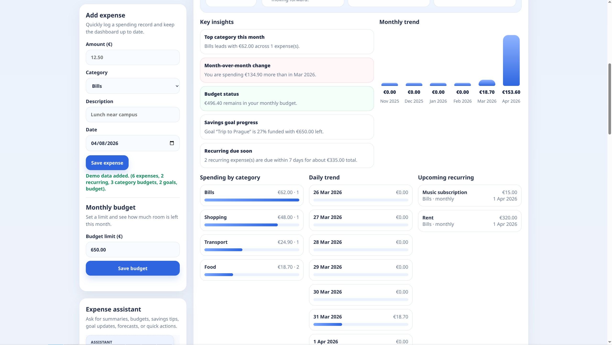
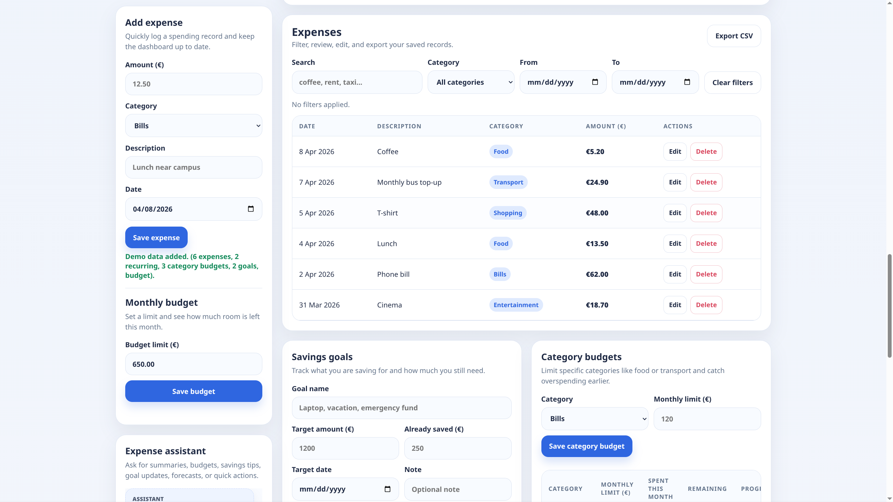
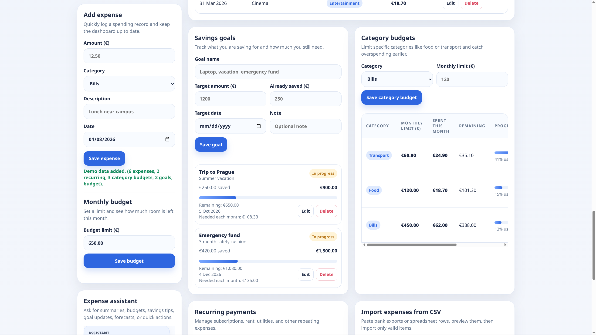
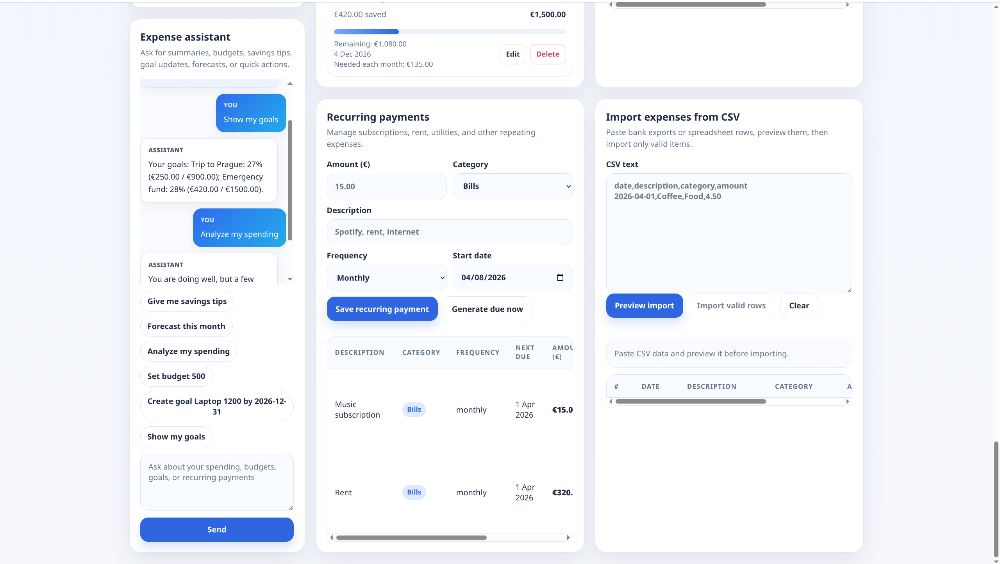

# ExpenseMate

A personal finance web application that helps users track expenses, manage budgets, savings goals, and recurring payments, and receive assistance from an AI-powered financial assistant.

## Demo

Below are screenshots of the current version of the product.







## Product context

### End users
ExpenseMate is designed for:
- students who want to manage their personal budget;
- people who want a simple tool to understand where their money goes;
- users who need a lightweight finance tracker with budgeting, recurring payments, and savings goals in one place.

### Problem that the product solves for end users
Many people do not clearly understand how they spend money during the month. Manual tracking is inconvenient, monthly spending is often underestimated, recurring payments are easy to forget, and savings goals are difficult to monitor consistently. As a result, users lose control over their budget and struggle to plan future spending.

### Your solution
ExpenseMate provides a single web application where users can:
- record expenses quickly;
- view all expenses in one place;
- set a monthly budget and category budgets;
- manage savings goals;
- track recurring payments;
- import and export expense data via CSV;
- use an AI assistant to analyze spending, answer finance-related questions, and perform quick actions.

The product combines expense tracking, budgeting, planning, and AI-based guidance in one interface that is easy to use and explain.

## Features

### Implemented features
- User registration and login
- Per-user isolated data
- Add, edit, delete, and view expenses
- Expense categorization
- Search and filtering by category, text, and date range
- CSV export of saved expenses
- CSV import with preview and duplicate detection
- Monthly budget tracking
- Category budget tracking
- Savings goals with progress tracking
- Recurring payments management
- Dashboard with summary cards and analytics
- Spending breakdown by category
- Daily trend and monthly trend analytics
- Automatic insights about spending and budget status
- Demo data generation
- Russian / English language switch
- AI assistant built into the web application
- Assistant support for:
  - spending analysis
  - budget questions
  - savings goal questions
  - recurring payment questions
  - quick financial actions and project-aware commands

### Not yet implemented features
- Receipt OCR / receipt scanning
- Email or push reminders
- Shared budgets for multiple users
- Advanced long-term reporting and downloadable reports
- Mobile client

## Main functionality overview

### Expense tracking
Users can create, edit, and delete expense records. Each expense contains:
- amount;
- category;
- description;
- date.

### Budgeting
The application supports:
- one monthly budget for the whole account;
- separate monthly budgets for categories such as Food, Transport, or Bills.

This allows users to understand both overall spending and overspending in specific areas.

### Savings goals
Users can create savings goals with:
- goal name;
- target amount;
- current saved amount;
- target date;
- optional note.

The interface shows progress and the remaining amount to save.

### Recurring payments
Users can create recurring records for subscriptions, rent, utilities, and other repeated expenses. The system supports recurring payment generation and helps users keep regular expenses visible.

### Analytics
The dashboard provides:
- total spending;
- average expense;
- largest expense;
- projected month-end spending;
- category breakdown;
- daily trend;
- monthly trend;
- key insights and financial health information.

### AI assistant
The assistant is integrated into the web application and helps users:
- ask questions about spending;
- understand budget status;
- review savings goals;
- check recurring payments;
- perform quick actions using natural-language commands.

It supports English and Russian prompts.

Examples:
- `Analyze my spending`
- `Show my goals`
- `Set budget 500`
- `Add coffee 4.50 food`
- `Create recurring rent 320 bills monthly`
- `Проанализируй мои траты`
- `Покажи мои цели`
- `Установи бюджет 500`

The assistant can work with built-in project-aware logic and can also use an external LLM through an OpenRouter/OpenAI-compatible API.

## Architecture

### Backend
- FastAPI

### Database
- PostgreSQL

### Frontend
- Static web frontend served through Caddy

### AI / agent component
- Built-in assistant endpoint
- Project-aware logic for finance actions and analysis
- Optional external LLM support through OpenRouter / OpenAI-compatible API

### Deployment
- Docker Compose
- VM-ready deployment flow for Ubuntu 24.04

## Usage

After starting the application:

1. Open the app in a browser.
2. Create an account or sign in.
3. Add expenses manually using the expense form.
4. Optionally click **Seed demo data** to populate the application with example records.
5. Set a monthly budget.
6. Optionally set category-specific budgets.
7. Create one or more savings goals.
8. Add recurring payments such as rent or subscriptions.
9. Use filters in the expenses table to search and review records.
10. Export expense data to CSV if needed.
11. Import CSV data through the import section.
12. Use the AI assistant for analysis and quick actions.
13. Switch the interface language between English and Russian.

## Deployment

### VM operating system
Ubuntu 24.04

### What should be installed on the VM
- Docker Engine
- Docker Compose plugin
- Git

### Step-by-step deployment instructions

1. Clone the repository:
   ```bash
   git clone https://github.com/Xerbelay/se-toolkit-hackathon.git
   cd se-toolkit-hackathon